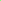
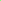
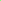
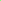
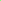
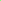

# GitNexus

GitNexus is a full-stack Git-like version control platform built with the MERN stack. It combines a custom VCS engine, a CLI workflow, a browser-based dashboard, JWT authentication, real-time updates with Socket.io, and AI-assisted commit/diff features to showcase end-to-end system design and product engineering.

## What It Does

GitNexus lets users:
- sign up and log in securely with JWT authentication
- create and manage repositories with user-based access control
- use Git-inspired VCS operations such as init, add, commit, branch, checkout, and merge
- inspect repository state in a web dashboard
- browse files, commits, and diffs in the frontend
- view commit history as a graph
- receive real-time UI updates through Socket.io
- generate AI-assisted commit messages and diff explanations

## Key Features

### Custom VCS Core
- repository initialization
- staging area support
- commit creation with hashed metadata
- branch creation and checkout
- merge support with commit history preservation

### Authentication and Authorization
- signup and login
- bcrypt password hashing
- JWT token generation
- protected backend routes
- user-based repository access

### Frontend Interface
- login and signup pages
- repository dashboard
- file explorer
- commit list
- diff viewer
- commit graph visualization

### Real-Time and AI Features
- Socket.io-powered live refresh flow
- AI commit message suggestions
- AI diff explanation support

## Tech Stack

### Frontend
- React
- React Router
- Vite
- Axios
- Tailwind CSS
- Primer React
- Socket.io Client
- React Flow

### Backend
- Node.js
- Express
- MongoDB
- Mongoose
- JWT
- bcryptjs
- Socket.io
- yargs

### AI and Infra
- OpenAI API
- MongoDB Atlas
- AWS SDK support in backend config

## Architecture Overview

The project is split into three major parts:

- `backend-main/`
  Express backend, auth, database models, routes, VCS services, real-time server, CLI entrypoint
- `frontend-main/`
  React frontend for auth, dashboard, files, commits, diffs, and graph views
- `backend-main/cli.js`
  Git-like CLI interface for running VCS operations directly

For the full technical breakdown, see [ARCHITECTURE_OVERVIEW.md](./ARCHITECTURE_OVERVIEW.md).

## Project Structure

```text
Github/
  backend-main/
    .env.example
    cli.js
    index.js
    package.json
    controllers/
    middleware/
    models/
    routes/
    services/
    utils/

  frontend-main/
    .env.example
    index.html
    package.json
    src/
      api/
      assets/
      components/
      hooks/
      pages/
      realtime/
      App.jsx
      authContext.jsx
      config.js
      index.css
      main.jsx

  docs/
    screenshots/
      login.png
      signup.png
      dashboard.png
      files.png
      commits.png
      diff.png

  README.md
  ARCHITECTURE_OVERVIEW.md
  SHOWCASE_FLOW.md
  FINAL_QA_CHECKLIST.md
  DEPLOYMENT.md
  .gitignore
```

## Screenshots

Add your screenshots here after capturing them:








## Local Setup

### Prerequisites

- Node.js
- npm
- MongoDB connection string
- OpenAI API key for AI features

### Backend Setup

```bash
cd backend-main
npm install
```

Create `.env` using `backend-main/.env.example`:

```
PORT=3000
MONGODB_URI=your_mongodb_connection_string
JWT_SECRET_KEY=your_jwt_secret
OPENAI_API_KEY=your_openai_api_key
FRONTEND_URL=http://localhost:5173
```

Start backend:

```bash
npm run dev
```

### Frontend Setup

```bash
cd frontend-main
npm install
```

Create `.env` using `frontend-main/.env.example`:

```
VITE_API_URL=http://localhost:3000
```

Start frontend:

```bash
npm run dev
```

## How To Test The Project

### Authentication Flow

- Open the frontend in the browser
- Sign up with a new account
- Log out
- Log back in
- Refresh the page and confirm the session persists
- Confirm protected pages redirect to login when logged out

### CLI / VCS Flow

Use the CLI in a test directory:

```bash
node "C:\path\to\backend-main\cli.js" init
node "C:\path\to\backend-main\cli.js" add sample.txt
node "C:\path\to\backend-main\cli.js" commit "first commit"
node "C:\path\to\backend-main\cli.js" branch feature-a
node "C:\path\to\backend-main\cli.js" checkout feature-a
node "C:\path\to\backend-main\cli.js" merge main
```

### Frontend Flow

Test these routes after login:

- `/` - Dashboard
- `/files` - File Explorer
- `/commits` - Commit List
- `/diff` - Diff Viewer

## API Overview

### User Routes
- `POST /user/signup`
- `POST /user/login`
- `GET /user/allUsers`
- `GET /user/userProfile/:id`
- `PUT /user/updateProfile/:id`
- `DELETE /user/deleteProfile/:id`

### Repo Routes
- `POST /repo/create`
- `GET /repo/all`
- `GET /repo/name/:name`
- `GET /repo/user/:userID`
- `GET /repo/:id`
- `PUT /repo/update/:id`
- `DELETE /repo/delete/:id`
- `PATCH /repo/toggle/:id`

### VCS Routes
- `GET /vcs/dashboard`
- `GET /vcs/files`
- `GET /vcs/files/:name`
- `GET /vcs/commits`
- `GET /vcs/commits/:hash`
- `GET /vcs/diff`
- `POST /vcs/ai/commit-message`
- `POST /vcs/ai/explain-diff`

### Health Route
- `GET /health`

## Demo Flow

For a recruiter/demo walkthrough, see [SHOWCASE_FLOW.md](./SHOWCASE_FLOW.md).

## QA Status

Testing and validation notes are in [FINAL_QA_CHECKLIST.md](./FINAL_QA_CHECKLIST.md).

## Deployment Notes

Before deployment:

- set production environment variables
- restrict CORS to the production frontend domain
- enable HTTPS
- deploy backend and frontend separately
- verify signup/login, protected routes, VCS pages, AI features, and real-time updates

For detailed hosting instructions, see [DEPLOYMENT.md](./DEPLOYMENT.md).

## What This Project Demonstrates

- custom version control concepts implemented in application code
- full-stack product engineering
- secure authentication and route protection
- API design and frontend integration
- real-time application architecture
- AI integration into developer workflows

## Author

Udit Singh

## License

ISC
